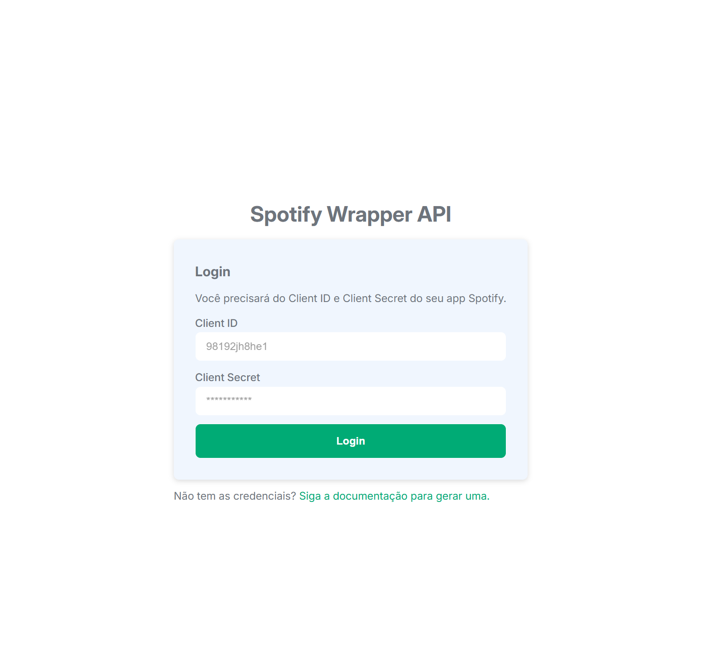

# NTT - Spotify Wrapper API

Projeto com a implementação do case técnico para o processo seletivo da NTT Data aonde foi utilizado a API do Spotify e implementado todo o fluxo de autenticação e consumo dos endpoints de `search`, `artists` e `albums` e a criação das respectivas interfaces.



## Rodando o projeto

## Pre-requisitos:
- **Git**
- **Node.js** ou **Docker**

Para executar o projeto há duas formas:

### Git Clone:

```
git clone https://github.com/mbarbosasan/ntt-spotify-api-wrapper
```

Na raiz do projeto: 

```
pnpm i
pnpm run start
```

Acesse `http://localhost:4200` e a aplicação estará disponível.

> [!NOTE]  
> Caso não tenha o pnpm pode ser utilizado o npm normal, os comandos são os mesmos.

### Docker

```
docker pull mbarbosas/ntt-case-tecnico

docker run -p 8080:80 mbarbosas/ntt-case-tecnico
```

Acesse `http://localhost:8080` e a aplicação estará disponível.

## Introdução

Abaixo algumas explicações sobre como foi feito a implementação.

### Estrutura

O projeto está estruturado da seguinte forma dentro da pasta "App":

**Core**: Se refere a dependências ou códigos que fazem parte do contexto "global" da aplicação, como por ex: Interceptors, Guards, Autenticação, Serviços de Autenticação e etc.

**Shared**: Essencialmente dependências que não fazem parte do "core" da aplicação e que podem ser utilizada por diversos "módulos/features" ao mesmo tempo, Ex: "blocos" de UI, Services.

**Features**: Considero como feature qualquer parte da aplicação que tem seu próprio contexto e requisitos, sendo especificamente nesse caso uma camada de "Dashboard" aonde o usuário autenticado fará as interações com a API e poderá consultar os artistas, albums e etc.

Considero que dentro de cada "feature" é completamente possível que existam outras features onde também exista um contexto específico e que vale a pena a modularização, nesse caso sendo "search", "artists" e "albums".

E por último mas não menos importante, cada "feature" tem suas próprias camadas: Services, Models/Types, Components e etc.

### Reatividade

A implementação foi pensada para ser completamente reativa utilizando RxJS e Signals e termos os benefícios de usarmos o "ChangeDetection" como OnPush, dessa forma a lógica fica centralizada nas services, que é então consumida pelos componentes e caso seja uma informação que deva ser exibida na UI é convertida para "Signal" através do [toSignal](https://v17.angular.io/api/core/rxjs-interop/toSignal).

> [!NOTE]  
> Signals estão em "Developer Preview" na v17 mas já se tornaram estável nas versõoes anteriores, caso exista alguma restrição sobre a utilização poderiam ser substituídos pelo "pipe async", sem problemas.

Pessoalmente eu entendo que desenvolvendo dessa forma o código se torna mais fácil de manter e de realizar "composição", uma vez que você tem uma "stream" de Observables você pode reutilizá-la e uma outra "stream" e gerar um novo resultado, além de "obrigar" o desenvolvedor a fazer um código "declarativo". Mas é opinião pessoal, entendo que existem outras opiniões e não vejo problemas em desenvolver de forma "estruturada" também.